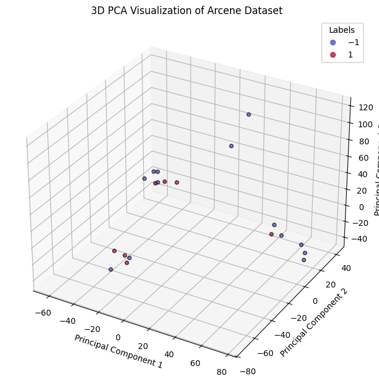

# Arcene Dataset Classification with PCA and SVM

## ✅ Project Overview
This project demonstrates the application of **Principal Component Analysis (PCA)** for dimensionality reduction and **Support Vector Machine (SVM)** with a linear kernel for classification on the **Arcene dataset**.

The Arcene dataset contains around **10,000 features per sample**, designed for feature selection and classification tasks (cancer vs healthy samples).

---

## 🚀 Steps Performed

1. **Data Loading**
   - Loaded the Arcene dataset (`arcene_train.data`) and labels (`arcene_train.labels`).
  
2. **Preprocessing**
   - Standardized the data using `StandardScaler` for normalization.

3. **Dimensionality Reduction**
   - Applied **PCA** to reduce the dataset to **2 or 3 principal components** for visualization and to reduce computational complexity.

4. **Classification**
   - Trained an **SVM classifier (Linear Kernel)** on the PCA-transformed data.

5. **Visualization**
   - Visualized the data in 2D or 3D using matplotlib to observe class separation.

---


## 📊 Example Visualization

- 2D PCA + SVM Classification boundary
- 3D PCA Scatter Plot of Data colored by Labels

---

## ⚡ Technologies & Libraries Used
- Python
- scikit-learn
- pandas
- matplotlib
- numpy

---

## 📁 Files
- `arcene_train.data` – Input dataset (features).
- `arcene_train.labels` – Class labels (1 or -1).
- `pca_svc_visualization.py` – Python script performing PCA + SVM + Visualization.
- `arcene_pca_visualization.png` – Example plot image.
- `README.md` – Project description.

---

## ✅ How to Run

1. Install dependencies (recommended in a virtual environment):
   ```bash
   pip install pandas scikit-learn matplotlib numpy
   ```

2. Run the visualization script:
   ```bash
   python pca_svc_visualization.py
   ```

---

## 📚 References
- [UCI Machine Learning Repository – Arcene Dataset](https://archive.ics.uci.edu/ml/datasets/Arcene)
- [scikit-learn PCA Documentation](https://scikit-learn.org/stable/modules/decomposition.html#pca)
- [scikit-learn SVM Documentation](https://scikit-learn.org/stable/modules/svm.html)

---

## ✍️ Author
RISHITHA V

---
